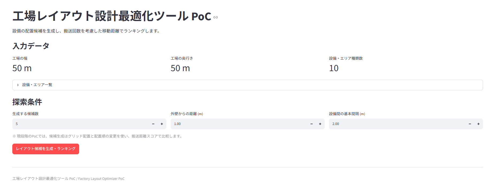
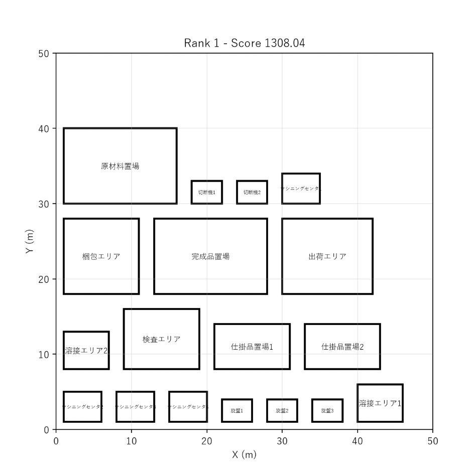
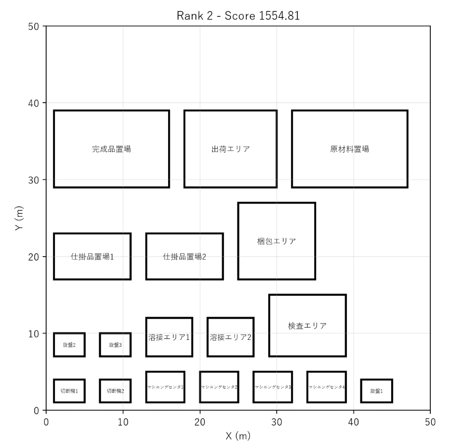
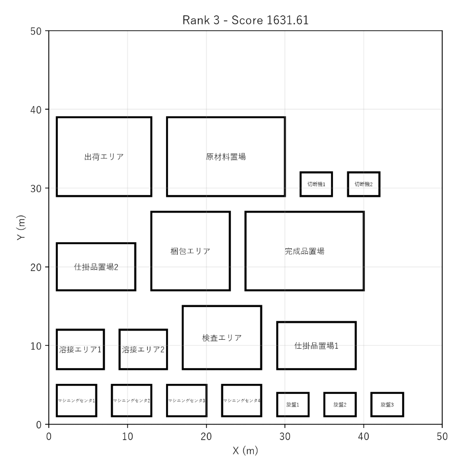

# 工場レイアウト設計最適化ツール PoC（v2）

工場の設備・エリアを入力すると、**配置候補を自動で作り、「距離 × 1日の搬送回数」で順位をつけて、
上位3案を図で見比べられる**試作です。

クラウドワークス テックに掲載されていた
**「工場建設時のレイアウト設計最適化アルゴリズム PoC」**（Python・フルリモート）の募集要項を題材に、
**一人で作れる大きさに切り出して自主制作**しました。

> **PoC（Proof of Concept）**＝「その考え方で本当に解けるか」を確かめるための試作。
> 本番の工場設計システムではありません。
>
> **要件は、ChatGPT に発注者（建設会社の設計担当）役を依頼した模擬ヒアリングで決めました。**
> **実在の企業・実案件ではありません。** 固定物の位置と安全基準の一部は仮の設定です。

| 文書 | 中身 |
|---|---|
| [docs/ヒアリングメモ.md](docs/ヒアリングメモ.md) | **模擬ヒアリングで決まったこと**と、その理由。v1 からの変化 |
| [docs/要件定義.md](docs/要件定義.md) | 工場の条件・設備・搬送量・安全基準・**実装の状況** |
| [docs/設計.md](docs/設計.md) | ファイルの役割・判定ルール・候補の作り方・評価式・テスト |
| [docs/ヒアリング計画.md](docs/ヒアリング計画.md) | ヒアリングの進め方（相手役への指示文・質問リスト・記録の型） |

---

## v1 から何が変わったか

**v1 は作りながら自分で条件を決めた。v2 は模擬ヒアリングで聞いてから決めた。**
その結果、前提がここまで変わりました。

| | v1（作りながら決めた） | **v2（聞いて決めた）** |
|---|---|---|
| 工場サイズ | 20m × 15m | **50m × 50m** |
| 設備・エリア | 6種類（各1つ） | **10種類・計18台**（台数つき） |
| 固定物 | なし | **柱16本・非常口4か所・電気室・受入口・出荷口** |
| 工程 | 1本（入庫→出庫） | **3パターン**（A 50%／B 30%／C 20%） |
| 評価 | 距離の合計 | **距離 × 1日の搬送回数** |
| 安全条件 | 隣接・離隔を各1組 | **通路幅・設備間・壁柱・非常口前・溶接の離隔** |
| 距離の測り方 | マンハッタン距離 | 中心間の直線距離 |

**いちばん大きい変化は「搬送回数」です。**
聞いてみると、**どの区間も同じ頻度で運ぶわけではありません**でした
（原材料→切断は1日30回、切断→旋盤は9回）。
**距離だけで比べると、ほとんど使われない動線のために良い案を捨ててしまう**と分かり、
評価式を「距離 × 回数」に変えました。

---

## 主な機能

- 設備・エリアを**台数ぶんに展開**して配置する（例：マシニングセンタ4台）
- 配置候補を**複数自動生成**する（並べる順番を変えて作る）
- **1日の搬送回数で重みをつけた移動距離**を計算する
- 候補を**スコアの小さい順に並べる**
- **上位3案を配置図で見比べられる**（Streamlit＋matplotlib）
- 候補数・外壁からの距離・設備間の間隔を**画面から変えられる**
- 置けないときは**日本語のメッセージ**で知らせ、アプリを落とさない

---

## 画面

**1. 入力データと探索条件**



**2. 上位3案を見比べる**





---

## 技術

| 技術 | 用途 |
|---|---|
| Python | 言語 |
| Streamlit | 画面（Python だけで Web 画面が作れる） |
| matplotlib | 配置図の描画 |
| pytest | 自動テスト（**37件・すべて成功**） |

外部の最適化ライブラリや機械学習は使っていません。**判定ロジックはすべて自分で書いています。**

---

## 動かし方

```bash
pip install -r requirements.txt   # 必要なライブラリを入れる
pytest                            # テストを実行する（37件）
streamlit run app.py              # 画面を起動する
```

---

## できていること／まだのこと

**第一版として、扱う範囲を意図的に絞っています。**

### できていること

- 工場からのはみ出し・設備どうしの重なり・面と面の距離の計算
- **壁・柱・非常口前・溶接エリアの離隔を判定する関数**（テストつき）
- 搬送回数で重みづけしたスコアの計算と順位づけ
- 入力値の検査と、日本語のエラー表示

### まだのこと（次にやること）

| # | やること | なぜ必要か |
|---|---|---|
| **1** | **候補を作るときに、安全条件の判定を呼ぶ** | いまは判定の関数があるだけで、**配置生成に効いていない**。条件を満たさない案も候補に残る |
| 2 | **固定物（柱・電気室・非常口前）を「置けない場所」として扱う** | いまはデータにあるだけで、配置では避けていない |
| 3 | 通路幅（フォークリフト3.0m・歩行者1.2m）を扱う | いまは設備間が一律2.0m |
| 4 | 処理時間を測って表示する | 要件は理想30秒・上限120秒。計測していない |
| 5 | 候補の作り方を工夫する | 並び順をずらすだけなので、**似た案が並びやすい** |

**1 を直すと「条件を満たす案だけが残る」ようになり、このツールの意味が大きく変わります。**

---

制作：2026年9月28日〜10月1日（v1 は2026年9月17日〜9月19日）

Copyright © 2026 dragon24dragon. All rights reserved.
